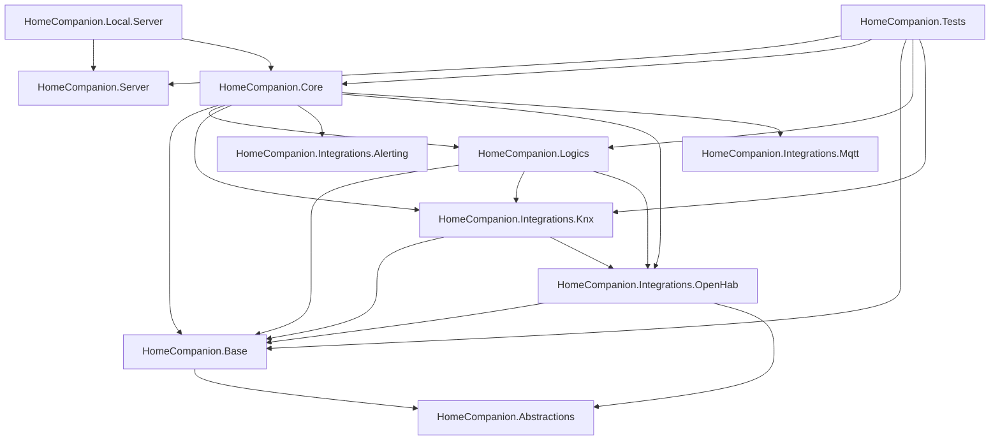

# HomeCompanion

**under development**

## Overview

HomeCompanion is a C# application designed to run in parallel to other home/building automation solutions, in particular KNX and OpenHAB.

It's built around the idea of

- having basic functionality at the KNX layer
- use OpenHAB for different UI/mobile scenarios as well as simple automation scripting
- use HomeCompanion for more complex or parametrized automation logic that is not easily implemented in OpenHAB's scripting languages or KNX's logic blocks.

Further devices in the home automation system are integrated either via MQTT and/or using OpenHAB's large number of supported bridges. The HomeCompanion framework provides modularity for adding further connectivity options as well as for implementing the automation logic itself. This provides an integration
path not only for other devices but also for integration with other home automation solutions.

## Features

### Framework features

- **Modular automation logic**: implement your automation logic as `ILogic` modules, which are loaded at runtime and can be enabled/disabled via configuration
- **Centralized value lifecycle**: `ValuesManager` initializes all discovered `IValue` instances at startup and routes `ValueUpdateReceived` / `ValueWriteReceived` events by `Target` to the owning value instance
- **Extensions framework**: add functionality via separate assemblies, implementing `HomeCompanion.Extensions.IExtension` to get loaded at runtime with opportunity for service injection. Extensions can contain their own logic modules, values containers, connectivity providers, and other services
- **KNX connectivity**: connect via KNX/net IP routing (UDP multicast) to a KNX system and receive/transmit Group Address write, read and read response telegrams
- **OpenHAB connectivity**: connect via OpenHAB REST API (item commands) and Websocket (event bus) to an OpenHAB instance and receive/transmit item state changes and commands. Inbound OpenHAB `ItemState*` events are mapped to `ValueUpdateReceived`-based events, while inbound `ItemCommandEvent` is mapped to `ValueWriteReceived`-based events.
- **MQTT connectivity**: connect to a MQTT broker and receive/transmit messages on specified topics
- **InfluxDB connectivity**: connect to an InfluxDB instance and write data points to specified measurements
- **User alerting**: send user notifications via email or channel them to an MQTT topic for using OpenHAB push notifications

### Contained logic modules

- ...

## Structure

The solution is organized into several projects:

- `HomeCompanion.Local.Server`: the local executable host used for development and deployment
- `HomeCompanion.Server`: reusable Blazor server library (UI components, endpoint mapping, and server hosting extension methods) intended for project/package consumption by thin host applications
- `HomeCompanion.Core`: contains the core run-time functionality of the framework. This includes for example the `LogicManager` which is responsible for loading and managing the `ILogic` modules, as well as the connectivity managers for KNX, OpenHAB, MQTT and InfluxDB
- `HomeCompanion.Base`: contains the base classes and for the framework, such as for example `LogicBase` which implements the `ILogic` interface with common basic functionality for the logic modules
- `HomeCompanion.Abstraction`: contains the abstractions for the framework, such as for example `ILogic` and `IDiagnostic` as well as the interfaces for the connectivity providers. These are used by the server application as well as the logic modules, and are implemented in the `HomeCompanion.Core` project and provisioned for use in the logic modules via dependency injection
- `HomeCompanion.Logic`: contains a selection of built-in logic modules, implementing the `ILogic` interface
- `HomeCompanion.Integrations.Alerting`: provides alert delivery paths (push-message via MQTT and e-mail via SMTP), alert routing, named-alert lifecycle management, and persistence integration
- `HomeCompanion.Tests`: contains unit tests for the framework and the logic modules, using NUnit

### Value event architecture

`IValue` instances are initialized once by `ValuesManager` during startup. Connectivity providers do not call `IValue.Initialize`.

Responsibilities are split as follows:

- `ValuesManager`: discovers values from registered `IValuesContainer` instances, calls `IValue.Initialize`, and performs centralized target-based routing for inbound `ValueUpdateReceived` / `ValueWriteReceived`
- Connectivity providers (KNX/OpenHAB/...): discover bus-mapped values for endpoint lookup and bridge bus traffic to/from event bus events
- Values (`ValueBase<T>`): remain bus-agnostic and only process routed payloads plus publish value change/write events

This avoids per-value event bus subscriptions and keeps bus-specific logic in connectivity providers.

### Dependencies

The application uses the following main dependencies:

- .NET 10.0 for the main application, including
  - `Microsoft.Extensions.DependencyInjection`
  - `Microsoft.Extensions.Logging`
  - `Microsoft.Extensions.Options`
- `NUnit` for unit testing
- `SRF.Network` for KNX, OpenHAB and MQTT connectivity
- `SRF.Knx` libraries for KNX-specific functionality, including DPT encoding/decoding and ETS GA export parsing

The internal project dependencies are as follows:



## Development approach

### Testing modes

The following maturity approach is foreseen:

1. unit testing based on NUnit tests which must run offline without access to the home automation environment
2. manual integration testing in the real environment, yet on a separate instance of the application
3. diagnostic features built into the application based on `IDiagnostic`, running in either version, real or testing
4. production operation in the real environment on a separate instance of the application

The application supports to run multiple innstances in parallel at once on the same home automation environment. This allows to have a "testing mode" instance, which can be used for testing new logic modules or changes to existing ones without affecting the "production mode" instance, which is running the stable automation logic for the home. Reason is that there's rarely a test environment for home automation and hands-on testing / pilot operation happens in the real environment. Avoiding interference between stable/production and testing instances is realized by enabling/disabling logic modules via configuration in either system.

## Getting started

### Prerequisites

- .NET 10.0 SDK
- Access to a KNX system (optional, for KNX connectivity)
- Access to an OpenHAB instance (optional, for OpenHAB connectivity)
- Access to a MQTT broker (optional, for MQTT connectivity)
- Access to an InfluxDB v2 instance (optional, for InfluxDB connectivity)

### Installation

The local executable to run everything is `HomeCompanion.Local.Server`.
`HomeCompanion.Server` is a reusable server library consumed by `HomeCompanion.Local.Server` (and by custom thin-wrapper hosts).

1. Clone the repository: ...
2. Build the application: `dotnet build HomeCompanion.Local.slnx`
3. Configure the application (see Configuration section below)
4. Run for testing: `dotnet run --project <your local solution root>/Server/HomeCompanion.Local.Server.csproj`

### Consuming HomeCompanion.Server from a thin wrapper

Custom host applications can keep their startup code minimal by referencing `HomeCompanion.Server` and delegating server wiring through extension methods.

```csharp
using HomeCompanion.Abstractions;
using HomeCompanion.Core;
using HomeCompanion.Server;
using HomeCompanion.Server.Components;

var builder = WebApplication.CreateBuilder(args);

builder.AddHomeCompanionCore();
builder.Services.AddHomeCompanionServer(builder.Configuration);
builder.Services.AddRazorComponents()
  .AddInteractiveServerComponents();

var app = builder.Build();

await app.Services.GetRequiredService<IHomeCompanionLifeCycleSynchronization>()
  .SignalInitializationStageCompletedAsync(AppInitializationStage.PreBuild);
await app.Services.GetRequiredService<IHomeCompanionLifeCycleSynchronization>()
  .SignalInitializationStageCompletedAsync(AppInitializationStage.PreRun);

app.MapHomeCompanionServer();
app.MapStaticAssets();
app.MapRazorComponents<App>()
  .AddInteractiveServerRenderMode();

await app.RunAsync();
```

This keeps host applications focused on environment-specific concerns (systemd integration, logging, and deployment defaults) while reusing server middleware/MCP wiring from `HomeCompanion.Server`.

Important static asset note for library hosts:

- UI files from `HomeCompanion.Server` are served from `_content/HomeCompanion.Server/*`
- Blazor framework bootstrap files are served from `/_framework/*`
- In a host/library split, the executable host must perform the `AddRazorComponents` + `MapStaticAssets` + `MapRazorComponents` calls shown above, otherwise routes like `/_framework/blazor.web.js` may not be generated and interactivity will fail
- `HomeCompanion.Local.Server` includes a minimal host-side Razor component (`Server/Components/FrameworkStaticAssetProbe.razor`) to keep host Razor static-web-assets discovery active in this split architecture

### Linux systemd service

For production on Linux, HomeCompanion can run as a systemd service.

For local development, keep using normal console startup with `dotnet run` or `dotnet watch`.
The server only enables systemd-specific host behavior when it is actually started by systemd.

1. Publish the local host to `/opt/homecompanion` using the full publish output (do not copy only the DLL; the folder must also contain the generated static web assets and runtime metadata).

1. Create the runtime user and directories:

```bash
sudo bash deploy/systemd/setup-homecompanion-user.sh
```

1. Install service files:

```bash
sudo cp deploy/systemd/homecompanion.service /etc/systemd/system/homecompanion.service
sudo cp deploy/systemd/homecompanion.env /etc/homecompanion/homecompanion.env
```

1. Reload and start service:

```bash
sudo systemctl daemon-reload
sudo systemctl enable --now homecompanion.service
```

1. Inspect state and logs:

```bash
sudo systemctl status homecompanion.service
sudo journalctl -u homecompanion.service -f
```

### HTTPS and host binding

If the app redirects from HTTP to HTTPS but the HTTPS connection fails, the usual cause is that Kestrel is only bound for HTTP and has no certificate-backed HTTPS endpoint configured.

For this repository, put the TLS endpoint and host filtering in `/etc/HomeCompanion.json` on the server. Keep `/etc/homecompanion/homecompanion.env` for process-level environment settings such as `ASPNETCORE_URLS`.

Example `/etc/HomeCompanion.json`:

```json
{
  "AllowedHosts": "localhost;myhost.mydomain",
  "Kestrel": {
    "Endpoints": {
      "Https": {
        "Url": "https://0.0.0.0:8118",
        "Certificate": {
          "Path": "/etc/ssl/homecompanion/homecompanion.pfx",
          "Password": "change-me"
        }
      }
    }
  }
}
```

In this setup:

- `AllowedHosts` allows both local access and the public host name.
- `https://0.0.0.0:8118` makes Kestrel listen on port `8118` on all interfaces.
- The certificate file must be a PFX that the service user can read.
- If you prefer to terminate TLS in a reverse proxy, configure the certificate there instead and let HomeCompanion listen on HTTP behind it.

### Configuration

HomeCompanion reads configuration from the normal ASP.NET Core sources and additionally from these optional JSON files:

- `/etc/HomeCompanion.json` for system-wide defaults
- `~/.config/HomeCompanion.json` for per-user overrides on Linux

Those files are loaded after `appsettings.json` and `appsettings.{Environment}.json`, but before environment variables. In practice this means:

- repository defaults live in the local host project's `appsettings.json` (`Server/HomeCompanion.Local.Server.csproj`)
- machine-specific settings belong in `/etc/HomeCompanion.json`
- user-specific or development overrides belong in `~/.config/HomeCompanion.json`
- environment variables still have the highest precedence

For a KNX/IP Routing setup, a minimal user configuration can look like this:

```json
{
  "Knx": {
    "ConnectionString": "Type=IpRouting;KnxAddress=1.1.10;LocalIpAddress=192.168.200.0/24",
    "EtsGAExportFile": "/path/to/GroupAddresses.xml",
    "KnxMasterFolder": "/path/to/knx-master",
    "KnxDomainConfigFile": "/path/to/KnxDomainConfig.json"
  }
}
```

Notes for KNX configuration:

- `Knx:ConnectionString` uses Falcon-style `key=value` pairs separated by `;` or `,`.
- `KnxAddress` sets the local KNX individual address used in outbound cEMI frames.
- `LocalIpAddress` selects the local network interface for KNX multicast. This is useful on hosts with multiple NICs where the default multicast route would otherwise use the wrong interface.
- `LocalIpAddress` accepts an exact host IP, a subnet base address, or CIDR notation. Examples: `192.168.200.23`, `192.168.200.0`, `192.168.200.0/24`, `fd00:1234::/64`.
- If multiple interfaces match the same subnet hint, Ethernet is preferred over Wi-Fi.
- If `LocalIpAddress` is omitted, HomeCompanion uses the operating system's default multicast interface.

The UDP multicast settings for KNX/IP Routing default to the standard multicast endpoint and usually do not need to be configured explicitly:

```json
{
  "Knx": {
    "Connections": {
      "default": {
        "MulticastAddress": "224.0.23.12",
        "Port": 3671
      }
    }
  }
}
```

Use `Knx:Connections` when you need to override UDP defaults per connection or connect to multiple KNX/IP Routing segments. If `Knx:Connections` is omitted, HomeCompanion registers a single connection named `default` and falls back to the library defaults for KNX/IP Routing.

### MQTT configuration

MQTT brokers are configured under `Mqtt:Brokers`. Each configured broker creates one MQTT connectivity provider instance and one keyed `IMqttBrokerConnection`.

```json
{
  "Mqtt": {
    "Brokers": {
      "main": {
        "Connection": {
          "Host": "mqtt-main.local",
          "ClientID": "homecompanion-main",
          "UseTls": true,
          "User": "hc",
          "Pass": "***"
        },
        "Subscriptions": [
          "home/+/+/state",
          "home/events/#"
        ]
      }
    }
  }
}
```

`Subscriptions` are high-level ingress filters. The value-level routing is still defined explicitly on `IValue.BusMappings` via `MqttBusEndpointMapping`.

Example mapping:

```csharp
BusMappings =
{
    [MqttBusEndpointMapping.GetBusId("main")] = new MqttBusEndpointMapping(
        brokerName: "main",
        stateTopicFilter: "home/living/temperature/state",
        commandTopic: "home/living/temperature/cmd")
    {
        Communication = BusCommunication.Receive | BusCommunication.Transmit,
        Config = new MqttBusMappingConfiguration
        {
            PayloadFormat = MqttPayloadFormat.JsonScalar,
            Qos = 1,
            Retain = false
        }
    }
}
```

See [Integrations.Mqtt/README.md](Integrations.Mqtt/README.md) for the MQTT-specific behavior and mapping options.

### Alerting configuration

Alerting is configured under `Alerting`.

The alerting integration supports:

- fire-and-forget alerts
- named alerts with status lifecycle (`Monitoring`, `Alert`, `Acknowledged`, `Disabled`)
- severity based path routing
- push-message delivery via keyed MQTT broker connections
- e-mail delivery via SMTP (MailKit)
- warning e-mail fallback to push-message route when configured

Example configuration:

```json
{
  "Alerting": {
    "Enable": true,
    "SeverityRouting": {
      "Info": ["Email"],
      "Warning": ["Email"],
      "Critical": ["PushMessage"],
      "Emergency": ["PushMessage", "Email"]
    },
    "Fallbacks": {
      "WarningEmailToCriticalPushMessage": true
    },
    "PushMessage": {
      "Broker": "main",
      "Topic": "homecompanion/alerts/critical",
      "Qos": 1,
      "Retain": false,
      "ContentType": "application/json",
      "PublishResultTimeoutMs": 5000
    },
    "Email": {
      "WarningRecipients": [
        "ops@example.org",
        "home@example.org"
      ],
      "Smtp": {
        "Host": "smtp.example.org",
        "Port": 587,
        "UseStartTls": true,
        "User": "alerts@example.org",
        "Password": "***",
        "From": "alerts@example.org"
      },
      "Templates": {
        "WarningSubject": "[HomeCompanion] Warning: {AlertKey}",
        "InfoSubject": "[HomeCompanion] Info",
        "CriticalSubject": "[HomeCompanion] Critical: {AlertKey}",
        "Body": "Severity: {Severity}\\nAlertKey: {AlertKey}\\nMessage: {MessageShort}\\nDetails: {MessageLong}\\nCorrelationId: {CorrelationId}\\nMetadata:\\n{Metadata}"
      }
    },
    "NamedAlerts": {
      "PersistState": true,
      "DefaultReminderInterval": "00:15:00",
      "PerSeverityReminderInterval": {
        "Warning": "00:30:00",
        "Critical": "00:10:00",
        "Emergency": "00:05:00"
      }
    }
  }
}
```

See [Integrations.Alerting/README.md](Integrations.Alerting/README.md) for alerting behavior, placeholders, and named-alert details.

### Influx internal signals configuration

Internal signal persistence to InfluxDB OSS v2 is configured under `Influx`:

```json
{
  "Influx": {
    "Url": "http://influxdb.local:8086",
    "Organization": "home",
    "Token": "***",
    "DefaultBucket": "homecompanion-internal",
    "FlushIntervalSeconds": 10,
    "MaxQueueSize": 500,
    "RetryCount": 3,
    "RetryDelaySeconds": 2
  }
}
```

Behavior summary:

- Measurements are enqueued and flushed in bulk either when the flush interval elapses, when the queue reaches `MaxQueueSize`, or during shutdown drain.
- `DefaultBucket` is used unless a measurement sets `BucketOverride`.
- Writes use a singleton InfluxDB client from `InfluxDB.Client`.

Extension activation note:

- The Influx implementation is an extension assembly (`HomeCompanion.Integrations.Influx`).
- Ensure the DLL is present in the app output directory or in the configured `HomeCompanion:ExtensionsPath` so extension discovery can load and register it.

See [Integrations.Influx/README.md](Integrations.Influx/README.md) for integration-specific API and usage details.
