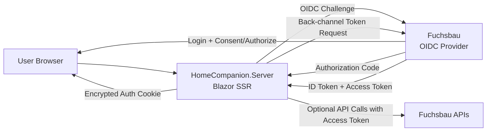

# Architecture Specification: Fuchsbau SSO for HomeCompanion.Server

**Date:** 2026-05-17
**Status:** Draft
**App 1 (Identity Provider):** Fuchsbau (`sfuchs-eng/fuchsbau`)
**App 2 (Relying Party):** HomeCompanion.Server

## 1. Purpose

Define a standards-based authentication and authorization integration where Fuchsbau acts as the identity provider (IdP) and HomeCompanion.Server consumes identities and fine-grained permissions.

## 2. Scope

In scope:
- User authentication for HomeCompanion.Server via Fuchsbau
- Single Sign-On (SSO) between App 1 and App 2
- Fine-grained authorization propagation (for example: `readonly` vs `interactive`)
- Localhost-first deployment assumptions

Out of scope:
- Replacing Fuchsbau internal user management
- Replacing HomeCompanion event/value architecture
- Federation with external identity providers (Google, Entra ID, etc.)

## 3. Context and Constraints

- App 1 is a Blazor Server + Blazor WebAssembly combo with existing user/auth management.
- App 2 is Blazor Server (SSR) and currently has no dedicated external OIDC login flow.
- Apps can communicate over localhost/internal network.
- A secure, standard protocol is preferred over ad-hoc token endpoints.

## 4. Architectural Decision

## 4.1 Protocol Choice

Use OAuth 2.0 + OpenID Connect (OIDC) with Authorization Code Flow and PKCE.

Rationale:

- Industry-standard protocol for cross-app authentication.
- Supports SSO cleanly.
- Keeps App 2 independent from App 1 internals.
- Enables future expansion (more relying parties, additional scopes/claims).

## 4.2 Provider Technology in App 1

Implement OIDC server capabilities in Fuchsbau using OpenIddict in the ASP.NET Core host.

Rationale:

- Fits existing custom/auth stack.
- Can reuse current user store and login UX.
- Provides OIDC endpoints and token issuance without changing core feature domains.

## 4.3 Consumer Technology in App 2

Use standard ASP.NET Core authentication middleware in HomeCompanion.Server:
- Cookie authentication as local session mechanism
- OpenID Connect handler as challenge/default external authentication scheme

Rationale:
- Native fit for Blazor Server SSR.
- Secure server-side token exchange and session handling.
- Minimal JavaScript and no token handling in browser code.

## 5. Target Architecture

Logical responsibilities:
- Fuchsbau: authentication, identity issuance, permission claim source of truth.
- HomeCompanion.Server: session establishment, policy enforcement, UI/page authorization.

## 6. Authentication and Authorization Flows

## 6.1 Login Flow (Authorization Code + PKCE)

1. User requests a protected page in HomeCompanion.Server.
2. App 2 detects unauthenticated state and issues OIDC challenge.
3. Browser is redirected to Fuchsbau authorization endpoint.
4. User authenticates in Fuchsbau (existing login process).
5. Fuchsbau returns authorization code to App 2 callback.
6. App 2 exchanges code for tokens on back-channel.
7. App 2 creates local encrypted auth cookie and serves requested page.

## 6.2 SSO Behavior

- If user already has active session in Fuchsbau, re-login is skipped and redirect chain is mostly transparent.
- App 2 keeps its own local session cookie derived from OIDC login.

## 6.3 Logout Strategy

Minimum viable:
- Local logout in App 2 clears local auth cookie.

Recommended full logout:
- Use OIDC sign-out redirect to Fuchsbau end-session endpoint.
- Optionally clear App 1 session and then redirect back to App 2 post-logout URL.

## 7. Fine-Grained Access Rights Model

The chat explicitly requested rights like `readonly` vs `interactive`.

Decision:
- Represent fine-grained rights in claims (for example `permission=readonly` or `permission=interactive`).
- Emit claims from App 1 during token issuance.
- Enforce claims in App 2 authorization policies.

Example policy mapping in App 2:
- `CanEdit`: requires `permission=interactive`
- `ReadOnly`: allows `permission=interactive` or `permission=readonly`

This model can later evolve to richer claim sets, such as:
- `hc:feature:*`
- `hc:area:<name>:read|write`
- role + claim hybrid checks

## 8. Security Requirements

- Use HTTPS even on localhost to mirror production security behavior.
- Store signing/encryption keys securely; do not use development certs in production.
- Keep OIDC client secret only on App 2 server-side configuration.
- Use short-lived access tokens and cookie/session expiration aligned to risk profile.
- Validate issuer, audience, signature, token lifetime in App 2.
- Protect callback and logout endpoints against open redirect misuse.
- Minimize claim payload to required authorization data.

## 9. Environment and Deployment Assumptions

Development:
- Localhost communication is acceptable.
- Self-signed dev certificates are acceptable.

Production:
- Distinct hostnames and valid TLS certificates.
- Stable issuer URL for Fuchsbau.
- Secure secret storage for client secret and signing material.

## 10. Integration Points by App

## 10.1 App 1 (Fuchsbau)

Required additions:
- OpenIddict server registration
- OIDC endpoints (`/connect/authorize`, `/connect/token`, optionally discovery and logout)
- Client registration for HomeCompanion.Server
- Claim emission pipeline for permission claims

Use existing Fuchsbau user auth/session as login authority.

## 10.2 App 2 (HomeCompanion.Server)

Required additions:
- Authentication registration (`AddCookie`, `AddOpenIdConnect`)
- Middleware order updates (`UseAuthentication`, `UseAuthorization`)
- Authorization policy setup for permission claims
- Protected routes/pages/components via `[Authorize]` and policy attributes
- Optional `AuthorizeView` sections to hide interactive controls for read-only users

Keep HomeCompanion core event/value subsystem unchanged.

## 11. Configuration Contract (Initial)

App 2 OIDC client configuration (logical fields):
- `Authority` (Fuchsbau base URL)
- `ClientId`
- `ClientSecret`
- `ResponseType=code`
- `Scopes`: `openid`, `profile`, plus app-specific API scopes if needed
- Name/role/permission claim mapping

App 1 client registration fields:
- Allowed redirect URIs
- Allowed post-logout redirect URIs
- Allowed scopes
- PKCE required

## 12. Alternatives Considered

## 12.1 Shared Cookie / Data Protection Key Ring

Possible when both apps share domain and trust boundary.

Pros:
- Fast to implement.

Cons:
- Tight coupling between applications.
- Weaker architectural boundaries.
- Harder future scaling to additional clients.

Decision:
- Not chosen as primary architecture.
- Can be temporary shortcut only if delivery pressure is very high.

## 12.2 App 2 Direct Username/Password Login Against App 1 API

Pros:
- Simple initial implementation.

Cons:
- Not standards-based SSO.
- Encourages credential handling in multiple places.
- Harder to evolve and secure consistently.

Decision:
- Rejected.

## 13. Non-Functional Requirements

- Authentication roundtrip should be predictable and resilient under localhost latency.
- Authorization checks must be enforced server-side for all state-changing actions.
- Failure mode must be deny-by-default when claims are missing or invalid.
- Diagnostics should log auth flow milestones without logging secrets/tokens.

## 14. Open Questions

- Exact permission taxonomy for HomeCompanion domains (global vs per-feature permissions).
- Whether App 2 needs App 1 API access token beyond login (or ID token + local cookie is enough).
- Session lifetime and refresh strategy requirements.
- Global logout behavior expectations across both applications.

## 15. Phased Delivery Plan

Phase 1:
- OIDC login from App 2 to App 1 works end-to-end.
- App 2 can protect pages with `[Authorize]`.

Phase 2:
- Permission claims (`readonly`/`interactive`) emitted by App 1.
- App 2 policies enforce read-vs-write behavior in SSR pages and actions.

Phase 3:
- Harden production security (certificates, key rotation, strict validation, logout flow).
- Add integration tests for login and policy enforcement.

## 16. Acceptance Criteria

- Unauthenticated access to protected App 2 routes redirects to App 1 login.
- Successful App 1 login returns user to App 2 and grants access.
- User with `permission=readonly` cannot execute interactive operations in App 2.
- User with `permission=interactive` can execute interactive operations in App 2.
- Missing/invalid claim results in denied access to protected operations.
- End-to-end flow works over localhost HTTPS.

## 17. Traceability to Source Chat

Key decisions captured from the Gemini conversation:
- Use OIDC/OAuth2 instead of ad-hoc authentication API.
- Prefer Authorization Code Flow with PKCE for this app-to-app browser flow.
- App 1 acts as token provider/IdP; App 2 as OIDC client.
- For fine-grained rights, pass permissions as claims and enforce via policies in App 2.

This document intentionally translates those recommendations into an implementable architecture for Fuchsbau and HomeCompanion.Server.
