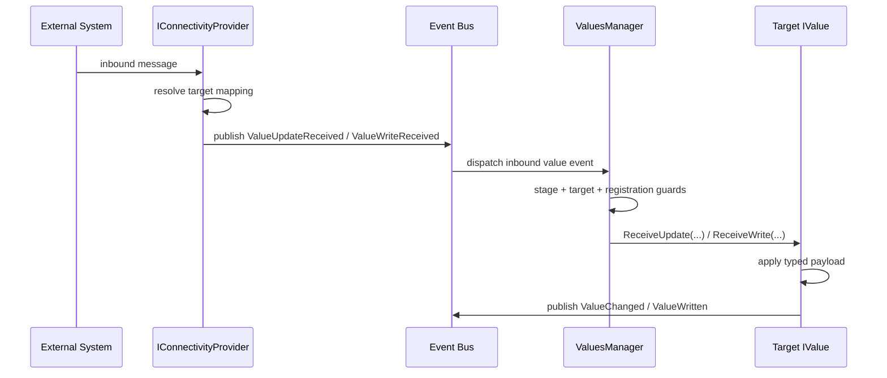

# Architecture Specification: Connectivity Provider to Value Routing

**Date:** 2026-09-19
**Status:** Implemented (documentation consolidation)
**Owner:** HomeCompanion.Core / HomeCompanion.Integrations

## 1. Purpose

Define one canonical description of how inbound data flows from any `IConnectivityProvider` implementation to `IValue` updates.

This document intentionally separates:

- Regular runtime operation (steady-state inbound processing)
- Initialization-time operation (lifecycle-gated startup and initial value acquisition)

## 2. Scope

In scope:

- Inbound path from provider receive callback to routed `IValue` update
- Responsibilities of `ConnectivityProviderBase`, `ValuesManager`, and `IValue` implementations
- Lifecycle gate behavior around `AppLifeCycleStage.InitValuesRegistered`
- Initialization differences versus regular operation
- KNX, MQTT, and OpenHAB concrete examples

Out of scope:

- Transport/protocol encoding internals (for example KNX DPT internals, MQTT wire framing)
- Provider-specific configuration details not needed for routing semantics

## 3. Architecture Roles

- `IConnectivityProvider`
: Bridge between external system and HomeCompanion event system.
- `ConnectivityProviderBase<TAddresses, TEndPointMapping>`
: Shared helper for value mapping discovery, startup gate waiting, and write-request subscription.
- `ValuesManager`
: Central initialization owner and central target-based inbound router.
- `IValue` / `IValue<T>` (`ValueBase<T>` in most implementations)
: Bus-agnostic state holder that applies routed payloads and raises value events.

## 4. Regular Runtime Flow (Primary Path)

Runtime inbound flow is always event-driven and target-routed.

1. Provider receives inbound message from external system.
2. Provider resolves mapped target value from provider-local map (address/topic/item -> `IValue`).
3. Provider publishes a value-level inbound event to HomeCompanion event bus:
   - `ValueUpdateReceived` for state/update style traffic
   - `ValueWriteReceived` for command/write style traffic
4. `ValuesManager` event handlers receive inbound events (`ValueUpdateReceivedHandler` or `ValueWriteReceivedHandler`).
5. `ValuesManager` applies routing guards:
   - lifecycle stage gate (`InitValuesRegistered` must be completed)
   - non-null target
   - target is registered
   - target implements `IValueEventReceiver`
6. `ValuesManager` routes to target:
   - update: `IValueEventReceiver.ReceiveUpdate(...)`
   - write: `IValueEventReceiver.ReceiveWrite(...)`
7. Target value implementation (`ValueBase<T>` in common case) applies typed payload and updates internal state.
8. Value raises/publishes value events as applicable (`Written`, `Changed`, `ValueWritten<T>`, `ValueChanged<T>`).

### 4.1 Sequence Overview

### 4.2 Concrete Provider Examples

- KNX
: `KnxConnectivityProvider.OnMessageReceived(...)` publishes `KnxGroupWriteReceived` / `KnxGroupResponseReceived` (derived from value-level inbound base events) after mapping destination GA to target value.
- MQTT
: `MqttConnectivityProvider.OnMessageReceivedAsync(...)` publishes `ValueUpdateReceived` or `ValueWriteReceived` based on route kind.
- OpenHAB
: `OpenHabConnectivityProvider.OnEventBusClientEventReceived(...)` converts OpenHAB events and publishes `OpenHabItemState` / `OpenHabItemStateChanged` (update path) or `OpenHabItemCommandReceived` (write path).

### 4.3 Failure and Drop Semantics

Inbound events are intentionally dropped (with diagnostics/logging) when:

- `InitValuesRegistered` stage is not yet completed
- target is null
- target is not registered in `ValuesManager`
- target does not implement `IValueEventReceiver`

Provider-level conversion failures do not crash routing; providers log and skip publishing for that message.

## 5. Initialization-Time Flow (Dedicated Path)

Initialization is lifecycle-gated and stage-aware. It is not the same as steady-state runtime routing.

## 5.1 Startup Sequence

1. `ValuesManager.StartAsync(...)` subscribes inbound handlers and discovers all values from `IValuesContainer` graphs.
2. `ValuesManager` calls `IValue.Initialize(IEventPublisher, IValuesManager)` for each discovered value.
3. Values register themselves through `IValuesManager.RegisterValue(...)`.
4. `ValuesManager` signals `AppLifeCycleStage.InitValuesRegistered` completion.
5. Connectivity providers that use startup gating (`ConnectivityProviderBase.WaitForStartupGateAsync(...)`) wait for that stage before enabling inbound processing.
6. Providers discover/build endpoint mapping lookup dictionaries from `IValue.BusMappings`.
7. Providers subscribe to external inbound callbacks and start normal operation.

## 5.2 Initialization Data Acquisition

After values are registered, providers can perform protocol-specific initial acquisition (if configured):

- KNX commonly issues initial read requests and applies responses through `InitializeValue(..., AppLifeCycleStage.InitBusValueReceived)`.
- OpenHAB marks provider initialization complete once wiring is active (state population arrives through normal event stream).
- MQTT initialization is typically equivalent to regular inbound flow once subscriptions are active.

## 5.3 Initialization vs Runtime: Key Difference

- Initialization can use explicit stage-aware initialization calls (`InitializeValue(value, stage)`) for first-state acquisition semantics.
- Runtime uses generic inbound event routing (`ValueUpdateReceived` / `ValueWriteReceived`) through `ValuesManager`.

Both paths converge on the same value abstractions, but they have different ordering, gating, and stage semantics.
The stage semantics are used to prevent "initialization downgrades" where a value might be re-initialized with a less reliable source after it has already been initialized with a more authoritative source. The primary scenario is to first load stored values from persistent storage, then download item states from OpenHAB to update IValue initializations, and lastly e.g. receive KNX bus updates to update IValue states.

## 6. Responsibilities Matrix

- `ValuesManager`
: Value discovery, value initialization wiring, lifecycle stage signaling, central inbound routing, route diagnostics.
- Connectivity providers
: Mapping discovery per protocol, external subscription lifecycle, payload conversion/normalization, inbound event publication, outbound write bridging.
- Values
: Thread-safe state updates, typed payload application, local validation/parsing helpers, value event publication.

## 7. Related Documents

- [README value event architecture](../../README.md#value-event-architecture)
- [ADR-0001: Bus values framework](../adr/0001-bus-values-framework.md)
- [ADR-0002: KNX connectivity provider](../adr/0002-knx-connectivity-provider.md)
- [ADR-0005: Unit-aware values framework](../adr/0005-unit-aware-values-framework.md)
- [MQTT connectivity provider architecture spec](homecompanion-mqtt-connectivity-provider-arch-spec.md)
